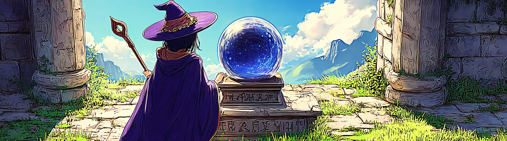
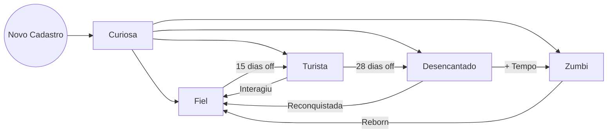

# Loyalty Predict

Construindo uma solução de Data Science junto com a comunidade do Téo Me Why!

Você pode conferir todo o material que ele oferece gratuitamente em [cursos.teomewhy.org](cursos.teomewhy.org).

Aqui Nesse README estarão minhas anotações do projeto e o que eu achar pertinente, você pode conferir o repositório do Téo [Loyalty Predict](https://github.com/TeoMeWhy/loyalty-predict)

## Índice

- [Objetivo](#objetivo)
- [Ações](#ações)
- [Pré Requisitos](#pré-requisitos)
- [Fonte de Dados](#fontes-de-dados)
- [Como nos apoiar](#apoie-o-nosso-trabalho)
- [Perguntas Frequentes](#perguntas-frequentes)

### Objetivo

Identificar perda ou ganho de engajamento dos usuários da nossa comunidade.

### Ações

- Métricas gerais do TMW;
- Definição do Ciclo de Vida dos usuários;
- Análise de Agrupamento dos diferentes perfís de usuários;
- Criar modelo de Machine Learning que detecte a perda ou ganho de engajamento;
- Incentivo por meio de pontos para usuários mais engajados;

### Pré Requisitos

Ferramentas necessárias para estar confortável em acompanhar o projeto. Você pode aprender todas elas no canal do Téo de maneira 100% gratuita:

- [SQL](https://www.youtube.com/playlist?list=PLvlkVRRKOYFRo651oD0JptVqfQGDvMi3j)
- [Python](https://www.youtube.com/playlist?list=PLvlkVRRKOYFSpRkqnR0p2A-eaVlpLnN3D)
- [Pandas](https://www.youtube.com/playlist?list=PLvlkVRRKOYFQHnDhjTmXLEz3HU5WTgOcF)
- [Estatística](https://www.youtube.com/playlist?list=PLvlkVRRKOYFQGIZdz7BycJet9OncyXlbq)
- [Machine Learning](https://www.youtube.com/playlist?list=PLvlkVRRKOYFR6_LmNcJliicNan2TYeFO2)
- [Git e GitHub](https://www.youtube.com/playlist?list=PLvlkVRRKOYFQyKmdrassLNxkzSMM6tcSL)

### Fontes de Dados

- [Sistema de Pontos](https://www.kaggle.com/datasets/teocalvo/teomewhy-loyalty-system)
- [Plataforma de Cursos](https://www.kaggle.com/datasets/teocalvo/teomewhy-education-platform)

### Apoie o trabalho do Téo

Abaixo deixo os links de acesso para o canal do youtube e da twitch do Téo, caso tenha caido aqui de paraquedas e se interessou, 
recomendo fortemente visitá-los uma vez que ele sempre está produzindo conteúdos de alta qualidade e gratuitos.

Se possível considere apoiá-lo. Você terá acesso a outras formas de apoio em https://cursos.teomewhy.org/ no final da página.

- 🎥 Membro no YouTube: [youtube.com/@teomewhy/membership](https://youtube.com/@teomewhy/membership)
- 🎮 Sub na Twitch: [twitch.tv/teomewhy](https://twitch.tv/teomewhy)

## Índice Etapas

- [Entendimento do negócio](#entendimento-do-negócio);
- Extração dos dados;
- Entendimento dos dados;
- Definição das variáveis;
- Criação das Feature Stores;
- Treinamento do modelo;
- Registro do modelo no MLFlow;
- Criação de App para Inferência em Tempo Real;
- Integração com Ecossistema TMW;

# Entendimento do negócio

## Sistema de pontos no chat da Twitch - Cubos
- !join para se cadastrar;
- !presente para assinar a lista de presença e ganhar cubos;
- Cada mensagem enviada no chat, recompensa 1 cubo;
- !troca realiza a troca de cubos por datapoints, moeda da loja no StreamElements.

Através dessas transações que é feita a identificação de atividade das pessoas, essa será a nossa referência.

Dessa forma conseguimos construir nosso CRM e saber quem é o público que está voltando.

Ou seja, a fonte de verdade do projeto está em [loyalty-system](data\loyalty-system)

## Plataforma de Cursos
- Todo catálogo de cursos e projetos que estão disponíveis no Youtube;
- A pessoa salva a progressão complentando vídeos;
- É possível preencher os dados de PDI que também ficam salvos;
- Há recompensas e integração com o sistema de pontos anterior.

Pessoas que só acessam a plataforma e o Youtube não são considerados dentro do ecossistema.

Só são considerados usuários ativos quem esta ativamente dentro do Sistema de pontos da Twitch.

## O que estamos procurando?
A partir do entendimento do negócio, precisamos também entender o que queremos responder.

Nosso objetivo inicialmente vai ser obter respostas para as seguintes perguntas:

- O que está acontecendo com engajamento das pessoas?
- Como estão as métricas gerais?
- O que podemos fazer para melhorá-las?

Aqui vamos utilizar algumas métricas:
 
DAU (Usuário Ativo Diário)
MAU (Usuário Ativo Mensal)

## O Ciclo de vida
Vamos tentar entender todas as possibilidades de comportamento do usuário
em relação ao consumo do produto.

O caso mais óbvio é o cliente que acabou de chegar. Se considerarmos a idade base (tempo desde o primeiro cadastro), podemos qualificar alguém como “novo”. Pensando num curso com duração mínima de uma semana, podemos chamar quem está na base por até 7 dias de “curioso”. Após esse período, a pessoa pode entrar em outras classificações.

Uma segunda dimensão é a recência — quantos dias se passaram desde a última interação do usuário. Por exemplo:

- Quem interage ao menos uma vez por semana pode ser classificado como “**fiel**”.

- Quem não interage há 15 dias podemos chamar de “**turista**”.

- Quem não aparece depois de 28 dias pode ser classificado como “**desencantado**”.

- Se não houver retorno depois disso, é o nosso “**zumbi**” (churn).

Também há casos de retorno:

- Um **desencantado** que volta a consumir antes de virar zumbi chamamos de “reconquistada”.

- Alguém que já era zumbi e volta chamamos de “**reborn**”.

Esses nomes são rótulos úteis para entender comportamentos, mas são arbitrários: ajuste os limiares e nomes conforme fizer mais sentido para o seu produto.

Note que esses nomes são apenas uma forma de identificar e tentar entender o fenômeno e é uma métrica arbitrária, podendo ser modificado de maneira que mais faça sentido a depender do caso.

O diagrama abaixo tenta ilustrar um pouco esse ciclo de vida.

